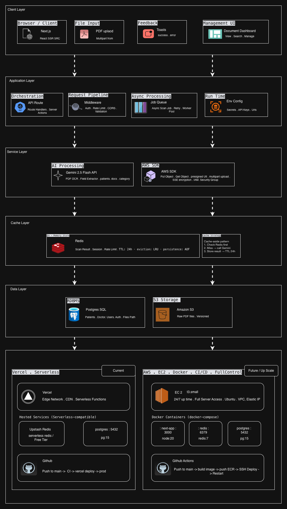
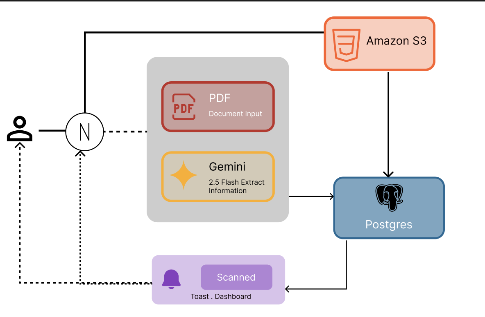
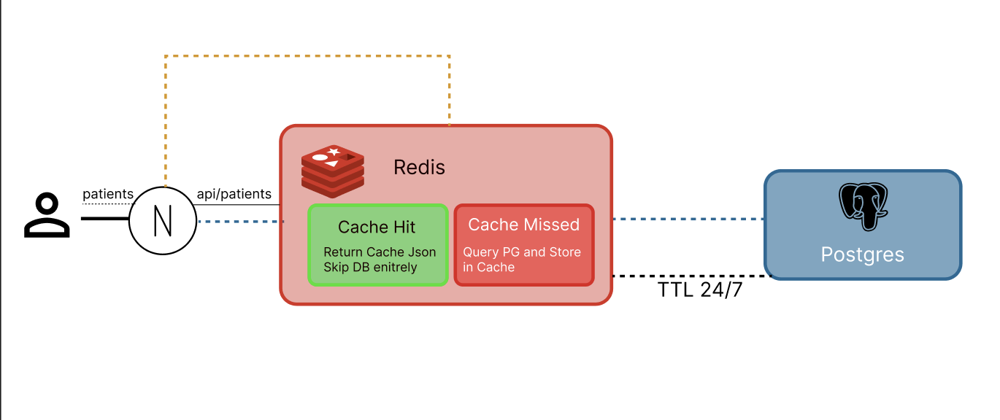

# Samantha.AI 🏥

> AI-powered document processing platform for clinics scan, extract, and manage patient records with ease.

[](https://nextjs.org)
[](https://www.typescriptlang.org)
[](https://deepmind.google/technologies/gemini)
[](https://aws.amazon.com/s3)
[](https://upstash.com)
[](https://neon.tech)
[](https://vercel.com)

---

## Overview

Samantha.AI is a clinic focused document management application that leverages Google's Gemini 2.5 Flash API to intelligently scan PDF documents, extract structured patient data, and store everything securely. It is designed to eliminate manual data entry, reduce processing time, and give clinic staff a clean interface to manage patient records.

---

## Features

- **PDF Scanning** : Upload patient documents and scan them using Gemini 2.5 Flash OCR
- **AI Extraction** : Automatically extract patient name, document type, category, and metadata
- **Secure Storage** : Raw PDF files stored in AWS S3 with private ACL and SSE-S3 encryption
- **Database Persistence** : Extracted data saved to PostgreSQL via Prisma ORM
- **Patient Read Cache** : Redis caches patient list queries for instant retrieval
- **Toast Notifications** : Real-time success and error feedback via reusable React components
- **Document Dashboard** : View, search, filter, and manage all scanned records
- **Two Deployment Modes** : Runs on Vercel (serverless) or AWS EC2 (Docker, full control)

---

## Tech Stack

### Frontend

| Technology   | Purpose                          |
| ------------ | -------------------------------- |
| Next.js 15   | React framework, SSR, API routes |
| TypeScript   | Type safety across the codebase  |
| Tailwind CSS | Utility-first styling            |

### Backend & Services

| Technology       | Purpose                         |
| ---------------- | ------------------------------- |
| Gemini 2.5 Flash | PDF OCR and field extraction    |
| AWS Service      | EC2, S3, EDBMS, Elastic Cache   |
| Prisma ORM       | Database queries and migrations |

### Infrastructure

| Technology      | Purpose                                |
| --------------- | -------------------------------------- |
| Neon / Supabase | Serverless PostgreSQL                  |
| Upstash Redis   | Serverless read cache for patient data |
| Amazon S3       | Secure PDF object storage              |
| Vercel          | Deployment, CDN, serverless functions  |
| GitHub Actions  | CI/CD pipeline                         |

---

## Architecture

### System Architecture



Samantha.AI follows a clean layered architecture with six distinct layers — Client, Application, Service, Cache, Data, and Infrastructure. The current production deployment runs on Vercel with Upstash Redis and Neon PostgreSQL. A self-hosted AWS EC2 + Docker setup is available for teams that need full server control.

---

## Data Flows

### Upload & Scan Flow



When a user uploads a PDF, the API route simultaneously stores the raw file in **Amazon S3** and passes the document through **Gemini 2.5 Flash** for OCR and field extraction. The extracted data — patient name, document type, category, and metadata — is then saved to **PostgreSQL** along with the S3 key reference. A toast notification confirms the operation to the user. Redis is not involved in this flow.

### Patient Retrieve Flow (Redis Read Cache)



When the dashboard requests the patient list, the API route checks **Upstash Redis** first:

- **Cache Hit** — Returns the cached JSON instantly, skipping the database entirely
- **Cache Miss** — Queries PostgreSQL, stores the result in Redis with a 24-hour TTL, then returns the data

This pattern keeps the dashboard fast and reduces database load significantly. Gemini is not involved in this flow.

---

## Getting Started

### Prerequisites

- Node.js 20+
- An [Upstash](https://upstash.com) Redis database (free tier)
- A [Neon](https://neon.tech) or [Supabase](https://supabase.com) PostgreSQL database (free tier)
- An AWS account with an S3 bucket
- A [Google AI Studio](https://aistudio.google.com) API key for Gemini

### Installation

```bash
# Clone the repository
git clone https://github.com/micaljohn60/samantha-ai.git
cd samantha-ai

# Install dependencies
npm install

# Copy environment variables
cp .env.example .env.local
```

### Environment Variables

Create a `.env.local` file in the root of the project:

```env
# ─── Gemini AI ────────────────────────────────────────
GEMINI_API_KEY=

# ─── AWS S3 ───────────────────────────────────────────
AWS_ACCESS_KEY_ID=
AWS_SECRET_ACCESS_KEY=
AWS_REGION=
S3_BUCKET_NAME=

# ─── Redis (Upstash) ──────────────────────────────────
REDIS_URL=
REDIS_ENDPOINT=
REDIS_HOST=redis
REDIS_HOST_PORT=

# ─── PostgreSQL ───────────────────────────────────────
DATABASE_URL=
PG_HOST=
PG_USER=
PG_PASSWORD=
PG_DATABASE=

# ─── App ──────────────────────────────────────────────
NODE_ENV=
NEXTAUTH_SECRET=

# ─── SMTP / Email Notifications ───────────────────────
SMTP_HOST=
SMTP_PORT=
SMTP_USER=
SMTP_PASS=
NOTIFY_EMAIL=
```

### Database Setup

```bash
# Run Prisma migrations
npx prisma migrate dev

# Generate Prisma client
npx prisma generate
```

### Run Locally

```bash
npm run dev
```

Open [http://localhost:3000](http://localhost:3000) in your browser.

---

## Project Structure

```
samantha-ai/
├── app/
│   ├── api/
│   │   ├── patients/        # Patient list endpoints (Redis cached)
│   │   ├── scan/            # PDF upload + Gemini extraction
│   │   └── documents/       # Document management endpoints
│   ├── dashboard/           # Document dashboard UI
│   ├── components/
│   │   ├── ui/              # Reusable components
│   │   └── notifications/   # Toast notification system
│   └── layout.tsx
├── lib/
│   ├── gemini.ts            # Gemini API client
│   ├── s3.ts                # AWS S3 client
│   ├── redis.ts             # Upstash Redis client
│   └── prisma.ts            # Prisma client
├── prisma/
│   ├── schema.prisma        # Database schema
│   └── migrations/
├── .env.example
├── Dockerfile
├── docker-compose.yml
└── README.md
```

---

## Database Schema

```prisma
model Patient {
  id         String     @id @default(cuid())
  name       String
  documents  Document[]
  createdAt  DateTime   @default(now())
  updatedAt  DateTime   @updatedAt
}

model Document {
  id            String   @id @default(cuid())
  patientId     String
  patient       Patient  @relation(fields: [patientId], references: [id])
  docType       String
  category      String
  s3Key         String
  extractedData Json
  createdAt     DateTime @default(now())
  updatedAt     DateTime @updatedAt
}

model Doctor {
  id          String   @id @default(cuid())
  gpName      String
  patients    Patient  @relation(fields: [patientId], references: [id])
  createdAt   DateTime @default(now())
}
```

---

## Deployment

### Vercel (Current — Recommended)

Samantha.AI is optimized for Vercel's serverless environment using managed cloud services.

1. Push your code to GitHub
2. Connect the repository to [Vercel](https://vercel.com)
3. Add all environment variables in the Vercel dashboard
4. Vercel will automatically deploy on every push to `main`

> **Note:** Vercel does not support persistent Docker containers. Use Upstash for Redis and Neon/Supabase for PostgreSQL.

### AWS EC2 (Self-Hosted — Future)

For full server control and Docker support:

```bash
# Build and run with Docker Compose
docker-compose up --build -d
```

`docker-compose.yml` runs three containers:

| Container  | Image          | Port |
| ---------- | -------------- | ---- |
| `next-app` | node:20-alpine | 3000 |
| `redis`    | redis:7-alpine | 6379 |
| `postgres` | postgres:15    | 5432 |

> **Note:** EC2 gives full control but requires manual ops and costs ~$30–100/month depending on instance size (recommended: t3.small or t3.medium).

### CI/CD with GitHub Actions

The included GitHub Actions workflow automatically:

1. Runs lint and type checks on every pull request
2. Builds a Docker image on merge to `main`
3. Deploys to Vercel production

Add these secrets to your GitHub repository settings:

```
VERCEL_TOKEN
VERCEL_ORG_ID
VERCEL_PROJECT_ID
GEMINI_API_KEY
AWS_ACCESS_KEY_ID
AWS_SECRET_ACCESS_KEY
DATABASE_URL
REDIS_URL
REDIS_TOKEN
```

---

## Contributing

1. Fork the repository
2. Create a feature branch: `git checkout -b feature/your-feature`
3. Commit your changes: `git commit -m 'feat: add your feature'`
4. Push to the branch: `git push origin feature/your-feature`
5. Open a Pull Request

Please follow [Conventional Commits](https://www.conventionalcommits.org) for commit messages.

---

## License

This project is licensed under the MIT License. See the [LICENSE](LICENSE) file for details.

---

## Acknowledgements

- [Google Gemini](https://deepmind.google/technologies/gemini) — AI-powered document extraction
- [Upstash](https://upstash.com) — Serverless Redis
- [Vercel](https://vercel.com) — Deployment platform
- [Prisma](https://prisma.io) — TypeScript ORM
- [AWS S3](https://aws.amazon.com/s3) — Secure file storage

---

<p align="center">Built with ❤️ for clinics that deserve better software.</p>
